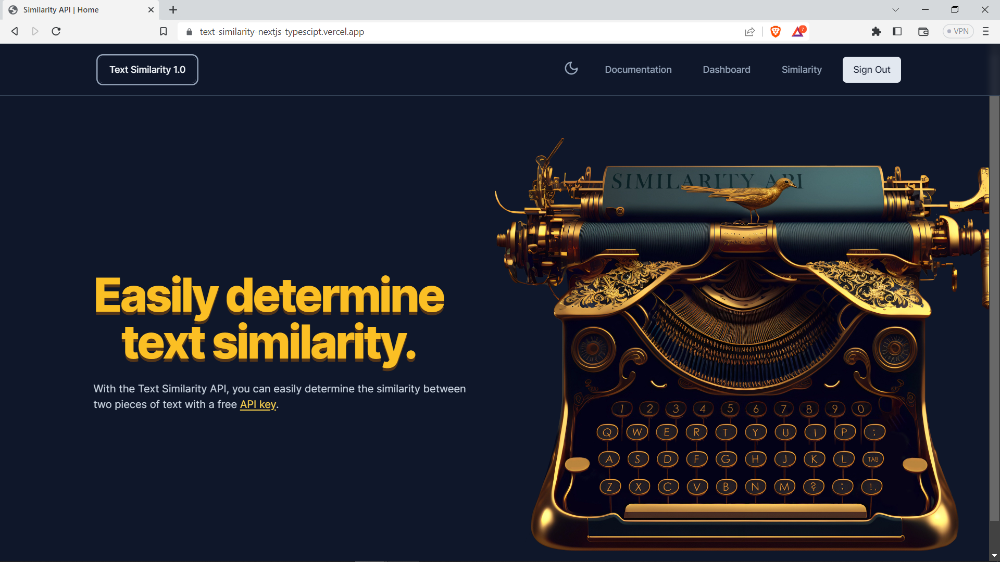
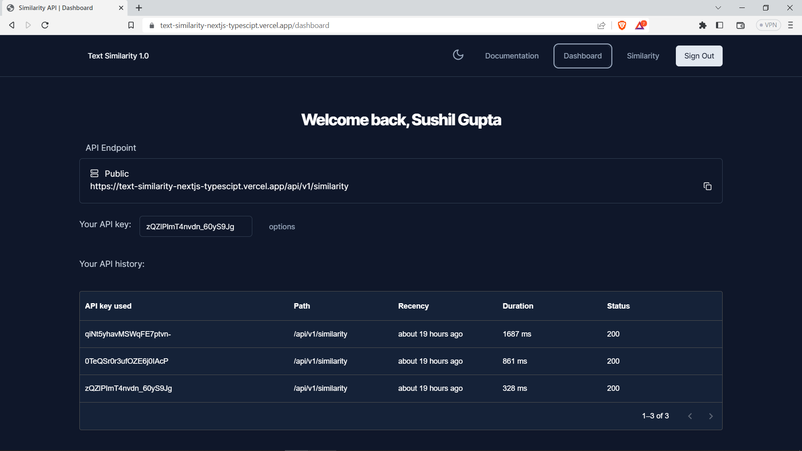

# Full Stack Text Similarity Next.js 13, App Router, React, Tailwind, Prisma, MongoDB, OAuth 2.0 and NextAuth 2023

#### https://sushil-text-similarity.vercel.app




### Features:

- Check two text similarity through API call or direct from webapp
- Generate new API key for authorization
- Revoke API key and copy API key with one click
- Table to show api calls
- Sign In with google account
- Tailwind design
- Tailwind animations and effects
- Full responsiveness
- Text form validation and handling using react-hook-form
- Server error handling using custom react-toast

### Prerequisites

**Node version 14.x**

### Cloning the repository

```shell
git clone https://github.com/AntonioErdeljac/next13-airbnb-clone.git
```

### Install packages

```shell
yarn
```

### Setup.env file

```js
NEXTAUTH_SECRET=
GOOGLE_CLIENT_ID=
GOOGLE_CLIENT_SECRET=
DATABASE_URL=
REDIS_URL=
REDIS_SECRET=
NODE_ENV=production
```

### Setup Prisma

```shell
npx prisma generate
npx prisma db push
```

### Start the app

```shell
yarn run dev
```

## Available commands

Running commands with yarn `yarn run [command]`

| command         | description                              |
| :-------------- | :--------------------------------------- |
| `dev`           | Starts a development instance of the app |
| `lint`          | Check any javascript error               |
| `build`         | To build the webapp                      |

